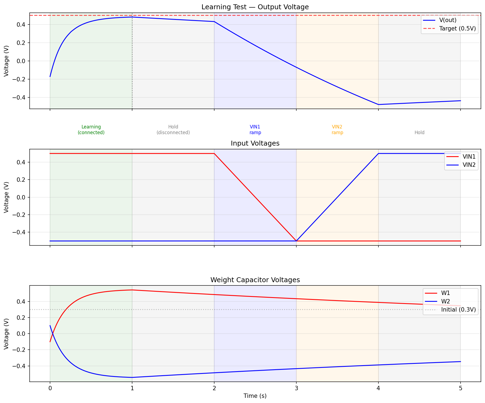
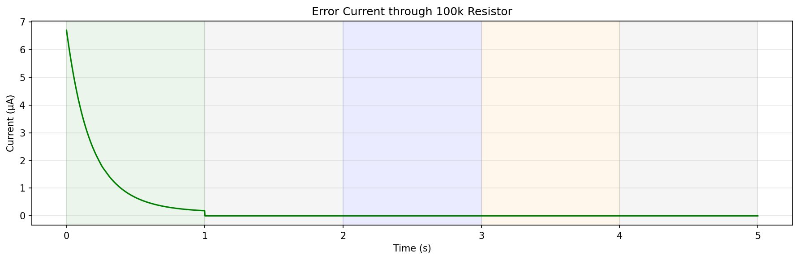

# Analog Neural Network

A single neuron implemented entirely in transistor-level analog circuitry, simulated in [ngspice](https://ngspice.sourceforge.io/). It computes a weighted sum of two inputs using Gilbert cell multipliers, stores weights on capacitors, and learns through gradient descent — all without ADCs, DACs, or digital logic.

## Neuron Interface

**Subcircuit `neuron`** — ports: `VIN1 VIN2 OUT VCC VEE W1_EXT W2_EXT`

```
          W1_EXT  W2_EXT
            |       |
     VIN1 --+-------+-- VIN2
            |       |
            | neuron|
            |       |
            +--OUT--+
                |
```

| Port | Function |
|------|----------|
| **VIN1, VIN2** | Input voltages (±1 V range). Also source/sink gradient current for upstream weight updates. |
| **OUT** | Forward output: `V_out = W1 × VIN1 + W2 × VIN2` (~277 Ω impedance). Backward: receives error as current from downstream. |
| **W1_EXT, W2_EXT** | External access to 100 nF weight storage capacitors. |
| **VCC, VEE** | +5 V / −5 V power rails. |

### Signal Convention

Forward signals are **voltages**; error and gradient signals are **currents**. This lets neurons chain naturally — a downstream neuron's gradient current loads the upstream neuron's output directly, with no explicit error bus.

- **Error** at OUT: 1 μA of error current produces 1 V internally (1 MΩ CCVS transimpedance).
- **Gradient** at VIN: `I = K × W × err` (K ≈ 1 μA/V²). Positive gradient = current sinking from upstream into VIN.
- **Weight update**: positive input × positive error → weight increases (stable negative feedback).

## How It Works

Digital neural networks multiply, add, and differentiate in floating-point. This circuit does the same with currents and voltages — about 40 BJTs, resistors, and capacitors. No op-amps, no digital control.

### Forward Path

Two NPN Gilbert cells (one per input) share a PNP current mirror load. A 15:1 resistive divider on each weight keeps the upper quad in the linear region of tanh. The combined differential current converts to voltage through a transimpedance resistor, then passes through an emitter follower and resistive divider for level shifting.

### Backward Path

Error enters as current at OUT. A zero-volt sense source and CCVS (1 MΩ) convert it to an internal voltage driving per-channel gradient cells — each a `bk_mult` Gilbert cell that multiplies weight by error, producing gradient current at the input terminal.

### Weight Storage

100 nF capacitors with 100 MΩ bleed resistors. Programmed through 10 MΩ series resistors from voltage sources.

## Learning Demonstration

The learning test demonstrates the neuron adapting its weights via gradient descent to match a target output. Run it with:

```bash
./run_learning.sh
```

### learning_test.png



Three panels showing the neuron over a 5-second simulation across five phases:

| Phase | Time | Description |
|-------|------|-------------|
| Learning | 0–1 s | Target (0.5 V) connected via 100 kΩ. Weights adapt to reduce error. |
| Hold | 1–2 s | Target disconnected. Capacitors retain learned values. |
| VIN1 ramp | 2–3 s | VIN1 sweeps +0.5 → −0.5 V. Output tracks via learned W1. |
| VIN2 ramp | 3–4 s | VIN2 sweeps −0.5 → +0.5 V. Output responds via learned W2. |
| Hold | 4–5 s | Final steady state. |

- **Top**: Output (blue) converging toward the 0.5 V target (red dashed), then responding to input ramps.
- **Middle**: Input voltages VIN1 (red) and VIN2 (blue).
- **Bottom**: Weight capacitor voltages W1 (red) and W2 (blue) evolving during learning, then slowly decaying through bleed resistors.

### learning_current.png



Error current through the 100 kΩ target resistor. Starts at ~7 μA and decays exponentially as the neuron learns, reaching near zero by disconnect at 1 s.

## Running Tests

```bash
# Individual test groups:
ngspice -b test_forward.spice      # DC operating point, DC sweep, transient
ngspice -b test_backward.spice     # Weight update via bk_mult
ngspice -b test_impedance.spice    # Output impedance
ngspice -b test_gradient.spice     # Chain rule, gradient linearity
ngspice -b test_integration.spice  # Isolation, coexistence, multi-config

# All tests:
ngspice -b neuron_tests.spice
```

## Files

| File | Description |
|------|-------------|
| `neuron.spice` | Subcircuit definitions: `bk_mult`, `neuron_ch`, `neuron` |
| `models.spice` | NPN and PNP BJT model definitions |
| `testbench.spice` | Shared testbench (power, weight programming, neuron instance) |
| `test_forward.spice` | Forward path tests (DC op, DC sweep, transient) |
| `test_backward.spice` | Backward path test (weight update) |
| `test_impedance.spice` | Output impedance measurement |
| `test_gradient.spice` | Gradient chain rule and linearity |
| `test_integration.spice` | Channel isolation, forward/backward coexistence |
| `test_learning.spice` | Learning demonstration (gradient descent to target) |
| `plot_learning.py` | Generates plots from learning test output |
| `run_learning.sh` | Runs learning simulation and plotting |
